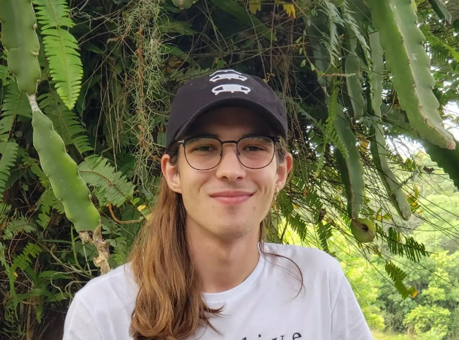

## Biologist

{width=300}

Hello, my name is João Afonso Poester-Carvalho and I am finishing my graduate degree in Biological Sciences (Universidade Federal do Rio Grande - FURG). Currently, I am focused on Biogeography and species distribution patterns. I use techniques such as Endemicity Analysis and Hierarchical Clustering to better understand species distribution patterns across the Neotropics.

During much of my graduation, I focused on studying programming and GIS tools to solve problems associated with my work.

I am much interested in studying Statistical and Machine Learning Models and their applications to ecological data, especially to conservation focus.

## Skills

I am especially interested and continuously developing my skills on:

- R Programming
  - General dataviz techniques
  - Quarto projects (such as this website!)
  - Interactive reports (Reactable; Leaflet)
  - Integration with Git and Github (version control, etc.)

- QGIS map building

- Google Earth Engine Programming

- Statistical techniques:
    - From the most basic Linear Models to Generalised Linear Mixed Models
    
- Machine Learning Algorithms 
    - Random Forests
    - Boosted Regression Trees
    - Support Machine Vector
    

